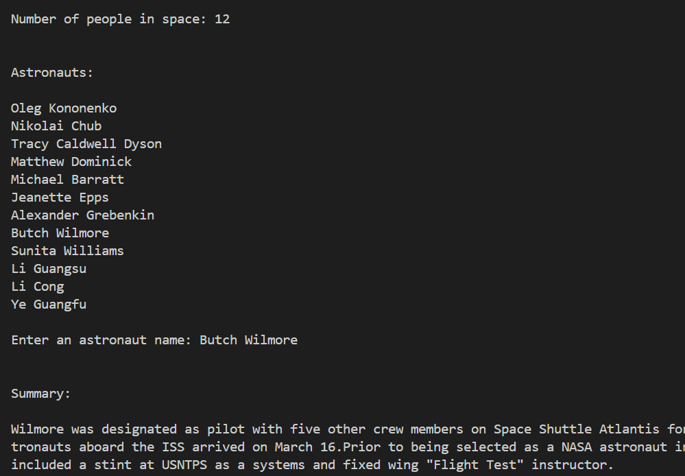

# Astronauts-Tracker

## A Python program to track the astronauts currently in space
This is a Python program to track the astronauts currently in space. The program uses Open Notify's People in Space Now API to get the current number of people in space, along with their names and the spacecraft they are on. The program also allows the user to get a summary of any astronaut's Wikipedia article by using web scraping and Natural Language Processing.

The program was a good chance practise web scraping using the BeautifulSoup4 Python library. It was also a chance to learn how to use the Natural Language Toolkit in Python to perform NLP techniques to summarize text, such as preprocessing, tokenization, removing stopwords, caculating word frequencies, etc.

## Demo

## Instructions
Clone the git repo and run main.py.